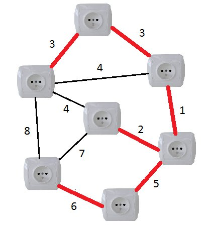
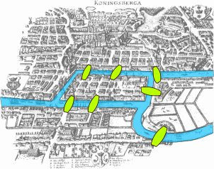

# Prendre connaissance de la situation et la clarifier

## Contexte

Dans le but de l’entretien d’une ville, on nous demande un algorithme
permettant d’avoir le parcours optimal de passage dans cette ville

## Mots Clefs

- Arbre Couvrant Minimal
- Graphe
- Modéliser
- Itinéraire
- Occupation CPU
- Algorithme
- Complexité
- Optimal
- Intersection
- Ville intelligente
- Chemin passant une seule fois par chaque point

# **Analyse du Besoin**

## **Problème(s)**

1. Comment déterminer la faisabilité d’un parcours (chemin passant une fois
par chaque rue) ?
2. Comment modéliser notre situation ?
3. Comment optimiser le temps de calcul ?
4. Comment gérer les exceptions ?

## **Contraintes**

- Temps de calcul
- Plan de la ville / Parcours
- Le parcours doit passer au moins une fois par toutes les rues
- Retour au point de départ obligatoire

## **Livrables**

- Graphe modélisant le parcours
- Algorithme permettant la génération de l’itinéraire

# **Généralisation du problème**

- Théorie des graphes
- Optimisation
- Modélisation mathématique / Graphe
- Identification d’un chemin eulérien

# Pistes de solutions

- Il est plus optimisé de ne pas revenir au point de départ (Julien).
- Certains points de départ ne permettent pas de résoudre le problème
- Si nous revenons au point de départ, nous ne parlons plus de chaine
eulérienne, mais de cycle eulérien (Romain)
- L’arbre couvrant minimal permet de trouver l’itinéraire optimal (Antonin).
- Dans le cas du schéma, il n’y a pas de solution possible (Julien).
- Algorithme limité à un nombre maximal d’intersections (Imad).
- il y a plusieurs solutions possible

# **Plan d’action**

1. Se renseigner sur les chaines et les cycles eulériens
2. Se renseigner sur la complexité des algorithmes
3. Se renseigner sur la théorie des graphes
4. Se renseigner sur l’Arbre Couvrant Minimal
5. Se renseigner sur les outils de modélisation des graphes
6. Déterminer quelle méthode de représentation est la plus adaptée
7. Trouver un modèle et un algorithme de modélisation
8. Modéliser les chemins (graphe)

# **Notion de cours**

## Graphes

### Définitions et usages

> Un graphe est un ensemble de points, dont certaines paires sont directement reliées par un (ou plusieurs) lien(s).
——
*Wikipédia*
> 

Ces points sont nommés **nœuds** ou **sommets**. Ces liens sont nommés **arêtes**.


Notez bien que ces fameux points n'ont pas de position absolue dans le plan, ni de position relative les uns aux autres. De la même façon, les arêtes ne sont pas forcées d'être droites (bien que conventionnellement on les représente comme tel par soucis de lisibilité) : elles peuvent se croiser, être courbées ou faire des détours, etc… Ainsi un graphe **n'est pas** une figure, bien que l'on puisse représenter un graphe par une figure. Les graphes ne se cantonnent donc pas à des considérations d’ordre purement géométrique, bien au contraire !

En effet, **un graphe sert avant tout à manipuler des concepts, et à établir un lien entre ces concepts**. N'importe quel problème comportant des objets avec des relations entre ces objets peut être modélisé par un graphe.

Il apparaît donc que les graphes sont des outils très puissants et largement répandus qui se prêtent bien à la résolution de nombreux problèmes.

**Minimiser l’usage de ressources avec les arbres couvrants minimaux**

En parlant de câblage, vous souhaitez que toutes vos prises soient reliées au secteur, non ? Cela est simple ! Mais le fil électrique coûte cher au mètre et vous souhaitez minimiser le prix de votre installation.

Ainsi, vous associerez un nœud à chaque **prise**, et une arête à chaque **fil** qu'il est *possible* (mais pas nécessaire) d'installer. A vous de choisir l'ensemble de câbles les plus courts pour relier toutes les prises !

Cela correspond à la recherche de **l'arbre couvrant minimal**.



**Poster du courrier**

Vous êtes le facteur d'un petit village, vous distribuez le courrier à vélo, à la seule force de vos jambes. Vous devez passer devant toutes les maisons du village, ce qui implique de traverser toutes les rues. Mais soucieux de préserver vos forces et de renouveler continuellement votre découverte des paysages, vous ne voulez pas traverser deux fois la même rue. Ici chaque nœud est un **carrefour**, et chaque arête une **rue**. Vous êtes en train de chercher un **circuit Eulérien** !

Il doit son nom à Leonhard Euler, qui chercha à savoir s'il était possible de franchir les 7 ponts de Königsberg sans jamais repasser deux fois sur le même (et en ne traversant le fleuve que grâce aux ponts, bien entendu).



### Vocabulaire

Maintenant que nous avons une idée de ce qu'est un graphe, tâchons d'employer un vocabulaire précis pour traiter de chacune de ses caractéristiques. Certains algorithmes ne fonctionnent que sur des graphes possédant certaines particularités.

Pouvoir décrire en quelques mots les caractéristiques principales d'un graphe est donc indispensable, et vous devez toujours avoir le réflexe de le faire sitôt le graphe identifié. Cela vous guidera vers le choix de l'algorithme approprié.

Fixons d'ores et déjà quelques notations, par soucis de clarté. Ces notations sont conventionnellement utilisées dans la plupart des cours ou articles parlant de graphes.

L'ensemble des nœuds du graphe est désigné par $*N*$. L'ensemble des arêtes est désigné par $A$. Le graphe $G$ est simplement défini comme $G=(N,A)$. Ainsi, la représentation du graphe importe peu : les deux graphes ci-dessous sont *isomorphes* (ici, on peut traduire grossièrement ce terme barbare par *équivalents*).


Une **boucle** est une arête qui relie un nœud à lui même. 

Un **lien double** caractérise l'existence de plusieurs arêtes entre deux nœuds donnés.

Un graphe possédant l'une ou l'autre de ces caractéristiques est dit **multigraphe**. Un graphe ne possédant aucune des deux est dit **graphe simple**.

Nous travaillerons exclusivement sur des graphes simples par soucis de simplicité : ils couvrent la plupart des utilisations, et sont plus simples à traiter que les multigraphes dans le cas général.


Multigraphe, avec une boucle en bleue et les liens double en rouge

Un graphe est dit **connexe** lorsqu'il existe un chemin entre toute paire de nœuds. Une composante connexe d'un graphe est un **sous-graphe** connexe de ce graphe. Un sous-graphe est un sous-ensemble de nœuds du graphe, avec une partie de leurs arêtes associées. Ainsi, sur le dessin ci-dessous, vous ne voyez **qu'un seul et unique graphe**, comportant 3 composantes connexes.


Graphe simple avec 3 composantes connexes

Voici une autre caractéristique fondamentale d'un graphe. Dans un **graphe orienté** les arêtes sont à *sens unique*. On les représente donc avec une flèche sur les dessins. D'ailleurs, le terme employé n'est plus arête, mais **arc**. Cette distinction est importante, car nombre d'algorithmes ne fonctionnent tout simplement pas sur des graphes orientés. Notez bien que cela n'empêche en rien que deux nœuds puissent être reliés dans les deux sens : il suffit d'utiliser deux arcs, chacun dans un sens (cela ne rompt pas la condition de graphe simple).


Graphe orienté

Dans un **graphe pondéré** les arêtes (ou les arcs) sont **pondérés**. Autrement dit, on associe une valeur à chaque arête.

Cela peut-être une distance : lorsque que l'on cherche un plus court chemin entre deux nœuds, il va de soit que la somme des pondérations des arêtes doit être aussi petit que possible.

Mais ça peut aussi être un réel dans [0;1] pour désigner des probabilités dans les [chaînes de Markov](http://fr.wikipedia.org/wiki/Cha%25C3%25AEne_de_Markov) par exemple. Cela peut aussi être un score, un prix, etc. N'importe quelle quantité qui peut vous passer par la tête !


3 variantes du même graphe, avec une pondération différente

Un graphe cyclique comporte au moins un **cycle**. Un cycle est un chemin qui permet de relier un nœud à lui même, sans jamais passer deux fois par la même arête. Un graphe comportant cette propriété peut-être orienté ou non orienté (indifféremment).

La détection de cycles est d'ailleurs un problème récurrent en informatique, notamment lorsqu'on s'intéresse aux dépendances d'un fichier ou d'un programme : **A** requiert **B**, **B** requiert **C**, et **C** requiert **A** est un cas de dépendances cyclique habituel.


Graphe orienté comportant un unique cycle

Les graphes ne possédant pas de cycles dont dit *acycliques*. Il existe un sous-ensemble remarquable de graphes acycliques : les **DAG** (pour *Directed Acyclic Graph*); ce sont des graphes acycliques orientés. Les algorithmes dynamiques (nous verrons ça plus tard) ne peuvent travailler que sur des DAG.


DAG

La **densité** d'un graphe correspond au **rapport du nombre d'arêtes sur le nombre total d'arêtes possibles**. C'est donc un réel compris entre 0 et 1. Cette caractéristique influe sur le choix de sa représentation.

Une densité de 0 correspond à un graphe sans arêtes où tout les sommets sont isolés.

Une densité de 1 correspond à un **graphe complet** : chaque nœud est relié à chaque autre nœud.


Graphe complet à 9 nœuds

Dans un graphe simple orienté de $N$ nœuds, chaque nœud ne peut être relié qu'à ses $N−1$ voisins au maximum, soit un total de $N(N−1)=N^2-N$ arcs.

Et $\frac {N^2-N}{2}$ arêtes dans le cas d'un graphe non orienté.

Le **degré** d'un nœud correspond au nombre d'arêtes reliées à ce nœud. Dans le cas d'un graphe orienté, le **degré entrant** d'un nœud est le nombre d'arcs qui aboutissent à ce nœud, et le **degré sortant** le nombre d'arcs qui partent de ce nœud.

De façon générale, lorsque le nombre d'arêtes d'un graphe est de l'ordre de $N$, le graphe est dit **creux**. Le degré moyen de ses nœuds est une constante. A l'inverse, lorsque le nombre d'arêtes est de l'ordre de $N^2$, le graphe est dit **dense** : le degré moyen de ses nœuds est de l'ordre de $N$.

La **matrice d'adjacence** est un tableau en deux dimensions. Chacune des dimensions est indexée par les nœuds du graphe (typiquement de 0 à $N-1$).

A l'intersection de chaque ligne et colonne on trouve un nombre : il vaut 1 si une arête relie les deux nœuds indexés par les coordonnées de la case, et 0 sinon.


On observe plusieurs choses intéressantes.

- Les boucles reliant un nœud à lui même sont sur la diagonale de la matrice.
- Cette matrice est symétrique par rapport à sa diagonale dans un graphe non-orienté (puisque si **A** est relié à **B**, alors **B** est relié à **A**).
- Si le graphe ne comporte aucune arête, alors c'est la matrice nulle.
- Si le graphe est creux, alors la matrice le sera aussi.
- Pour $N$ nœuds, cette matrice est de taille $N \times N$. Soit une complexité de $O(N^2)$ en mémoire. Si votre langage le permet, vous pouvez stocker chacun des booléens sur un bit; il en résulte une consommation en mémoire de $\frac {N^2}{8}$ octets exactement, ce qui est très compact (incompressible dans le cas général).
- Vous pouvez itérer sur tout les voisins d'un nœud en $O(N)$
- En outre, à tout moment vous pouvez déterminer si deux nœuds sont voisins (c'est à dire reliés par une arête) en $O(1)$
- Pour finir les ajouts et retraits d'arêtes se font en $O(1)$

Si cette représentation est couteuse pour un graphe creux (on lui préférera la liste d'adjacence), elle devient très rentable pour un graphe dense.

**La densité est souvent le critère décisif du choix entre la matrice ou la liste.**

Si le graphe est pondéré, vous pouvez remplacer les booléens par des nombres correspondant à la pondération de chaque arête. Et vous fixez une valeur spéciale pour signifier l'absence d'arête (−1−1, 00 ou ∞∞ par exemple, selon les cas).


Les matrices d'adjacence sont particulièrement usitées lors de démonstrations sur un graphe, car la matrice est un outil mathématique bien connu.

# Solutions

La première étape de la solution consiste à reproduire la situation:


Une certaine quantité de ces points peuvent être supprimés pour simplifier notre problème, voilà ce que l’on obtient:


Cet algorithme est une implémentation de la recherche d'un chemin semi-eulérien dans un graphe. Un chemin semi-eulérien est un chemin qui parcourt chaque arête du graphe exactement une fois et qui revient au sommet de départ.

Voici comment cela fonctionne :

1. L'algorithme commence par initialiser un chemin vide et une fonction interne `find_path`.
2. La fonction `find_path` est une fonction récursive qui prend un nœud en entrée et parcourt tous ses voisins. Pour chaque voisin, si l'arête entre le nœud et le voisin n'a pas encore été parcourue (c'est-à-dire si la valeur correspondante dans le graphe est supérieure à 0), elle décrémente la valeur correspondante dans le graphe pour marquer l'arête comme parcourue, puis elle appelle récursivement `find_path` avec le voisin comme nouveau nœud.
3. Après avoir parcouru tous les voisins d'un nœud, la fonction `find_path` ajoute le nœud au chemin.
4. L'algorithme principal appelle ensuite `find_path` avec le point de départ comme nœud initial, puis retourne le chemin trouvé.
5. Le temps d'exécution de l'algorithme est également mesuré et affiché.

Voici le graphe de notre situation:

```python
graph = {
    'A': [0, 1, 1, 0, 0, 0, 0, 0, 0, 0],
    'B': [1, 0, 0, 0, 0, 0, 0, 1, 0, 0],
    'C': [1, 0, 0, 1, 0, 0, 0, 0, 0, 0],
    'D': [0, 0, 1, 0, 1, 0, 1, 0, 0, 0],
    'E': [0, 0, 0, 1, 0, 1, 0, 0, 0, 0],
    'F': [0, 0, 0, 0, 1, 0, 1, 0, 1, 0],
    'G': [0, 0, 0, 1, 0, 1, 0, 1, 0, 1],
    'H': [0, 1, 0, 0, 0, 0, 1, 0, 0, 0],
    'I': [0, 0, 0, 0, 0, 1, 0, 0, 0, 1],
    'J': [0, 0, 0, 0, 0, 0, 1, 0, 1, 0]
}
```

Et voici mon algorithme de parcours :

```python
def find_eulerian_path(graph, start):
    if not is_eulerian(graph):
        return "Le graphe n'est pas eulerien"
    path = []
    def find_path(node):
        for i, neighbor in enumerate(graph[node]):
            if neighbor > 0:
                graph[node][i] -= 1
                graph[list(graph.keys())[i]][list(graph.keys()).index(node)] -= 1
                find_path(list(graph.keys())[i])
        path.append(node)
    find_path(start)
    return path
```

La fonction de vérification du graph :

```python
def is_eulerian(graph):
    for node in graph:
        if sum(graph[node]) % 2 != 0:
            return False
    return True
```

Et voici un exemple d’appel de cette fonction :

```python
start_point = 'I'
start = time.time()
path = find_eulerian_path(graph, start_point)
end = time.time()
print(path)
print("Temps d'exécution : ", end - start, "s")
```

# Ressources

https://zestedesavoir.com/tutoriels/681/a-la-decouverte-des-algorithmes-de-graphe/727_bases-de-la-theorie-des-graphes/3352_graphes-et-representation-de-graphe/

https://www.youtube.com/watch?v=F1G4srEXq2s

https://www.youtube.com/watch?v=Wl5klUAXChA

https://univ.scholarvox.com/catalog/book/docid/88840776

https://univ.scholarvox.com/catalog/book/docid/88817457

https://univ.scholarvox.com/reader/docid/88919478/page/62